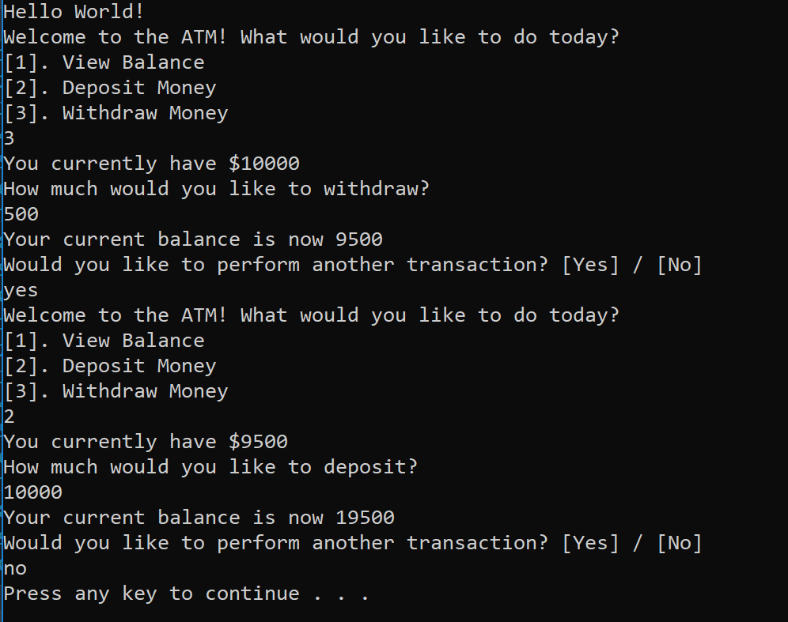

# Lab2 Unit Testing (ATM)

This is a console app that simulates a simple ATM machine that does not require authentication and provides basic ATM services (Withdrawal, Deposit, and Balance Check).

## Getting Started

Open the project with Visual Studio, and run (Ctrl + F5). 

Alternatively, you can navigate to project folder with PowerShell, then do the following.

 ```
 dotnet run
 ```

 Proceed by following console instructions.

 ## Visualization

 